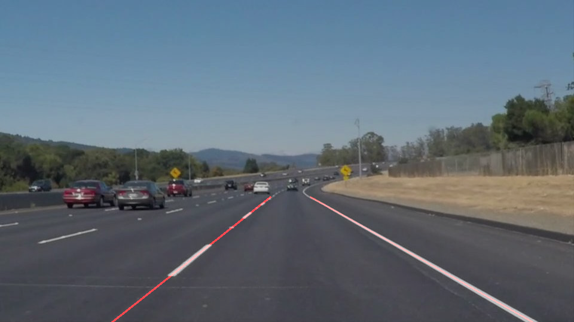

# **Finding Lane Lines on the Road** 

**Finding Lane Lines on the Road**

The goals / steps of this project are the following:
* Make a pipeline that finds lane lines on the road
* Reflect on your work in a written report

### Reflection

### 1. Describe your pipeline. As part of the description, explain how you modified the draw_lines() function.

My pipeline consisted of 7 steps. First I converted given image to grayscale image. Then I applied gaussien blur to smooth image file for smoothing. As third step, I have applied Canny trnsform for edge detection. Afterthat I selected region of interest (vertices of quadrilateral, 4 coordinates of x and y). In order to get straight lines, I applied Hough transform. 

In order to draw a single line on the left and right lanes, I modified the draw_lines() function by finding slope of the each lines using formula, m = (y1 - y2)/(x1 - x2). We know that line with negative slope in on the left side of road in the image and positive slope is for right side. I chose slopes in range (+/-0.25, +/- 1.0) for better result. Based on that, I sorted x,y coordinates of left and right lines. Using OpenCV polyfit, common line slope and intercept calculated. Taking maximum and minimum y coordinates as same as region of interest mask, x coordinates are found using calculated slope and intercept.  

These are the image outcomes of the pipeline.

SolidWhiteCurve: 

solidWhiteRight: 

solidYellowCurve: 

solidYellowCurve2: 

solidYellowLeft: 

whiteCarLaneSwitch: 

### 2. Identify potential shortcomings with your current pipeline

One potential shortcoming would be what would happen when a sharp curve comes since it produces only staight lines.

Another shortcoming could be shaking of lines in video processing.

### 3. Suggest possible improvements to your pipeline

A possible improvement would be to reduce shaking on video processing.

Another potential improvement could be to design better line features like thickness, length and color
